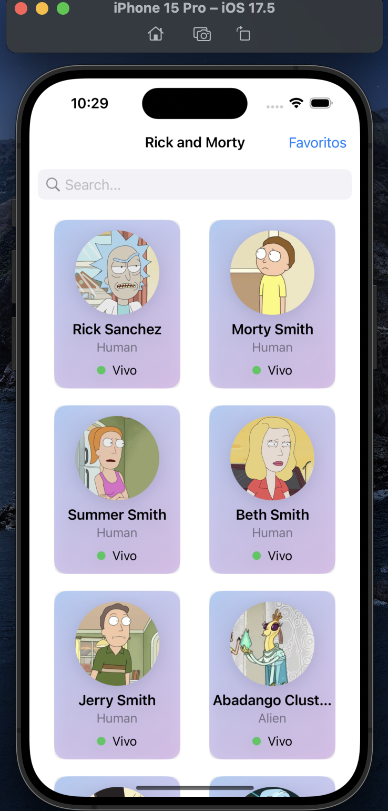
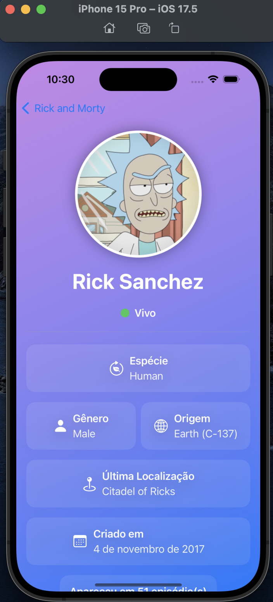
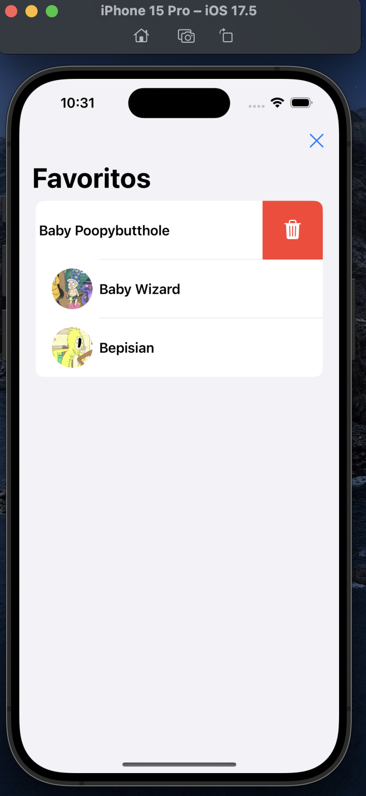
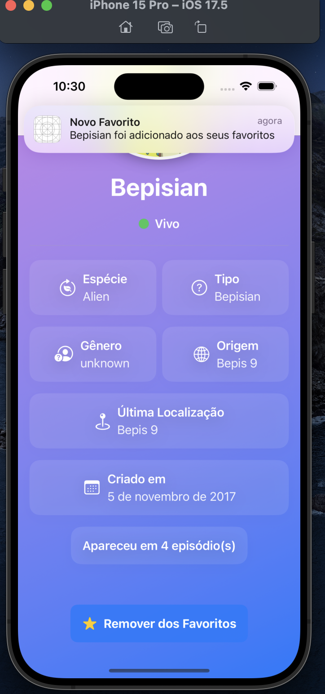
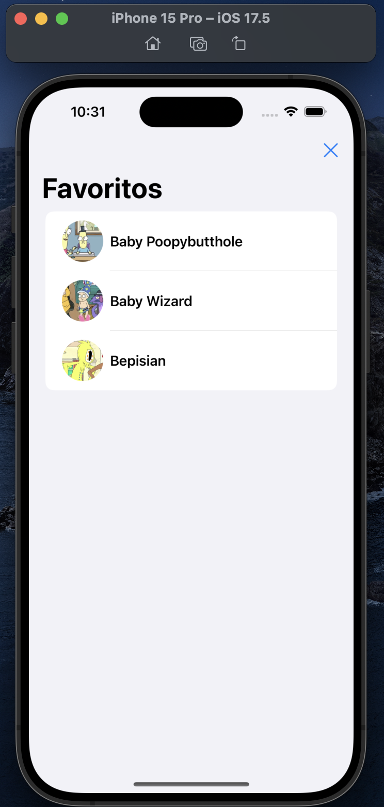

# ExchangeApp
Aplicativo que consome e mostra os dados da api https://rickandmortyapi.com/documentation

# Funcionalidades
- Listagem de personagens
- busca de personagens
- mostra detalhes
- favoritar personagens
- Remove favoritos

# Tecnologias utilizadas
- SwiftUI
- MVVM
- Notifications
- Requisições HTTP
- SwiftData
- Combine
## Layout mobile

  
  
  
  
  
 

